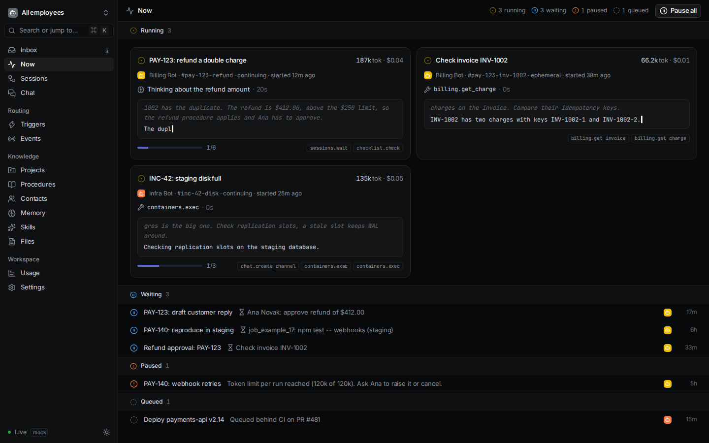
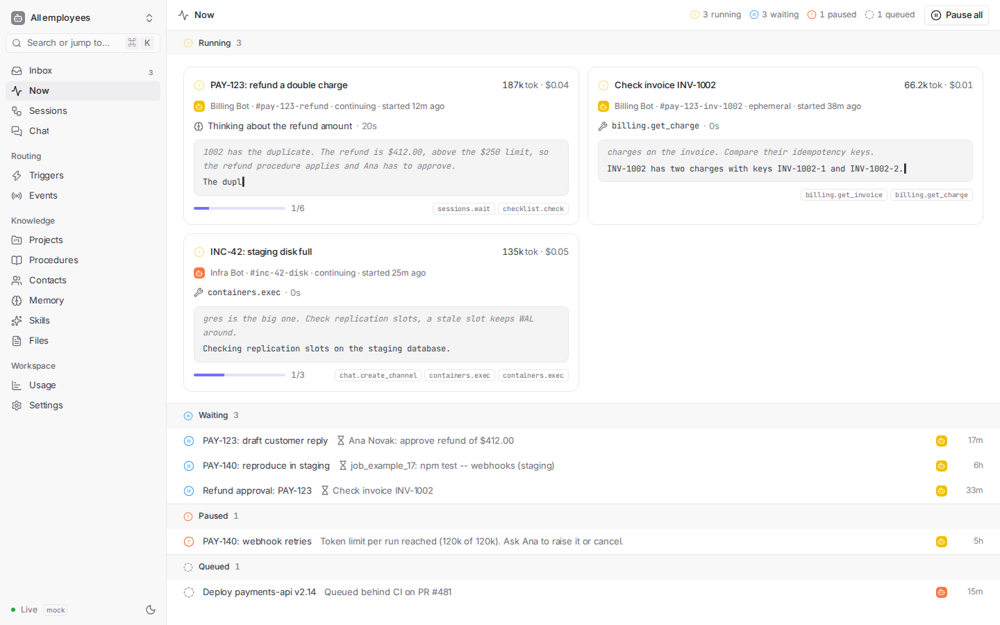

# @mp/web

The web UI (layer L6): Vite, React 19, TypeScript, Tailwind CSS v4 and shadcn/ui,
styled after Linear per [docs/stylebook.md](../../docs/stylebook.md). It depends
only on `@mp/api`.

```sh
npm run dev -w @mp/web          # against the server on :3000 (Vite proxies /api, /healthz, /readyz and /ws)
npm run dev:mock -w @mp/web     # with the in-browser mock API and live stream (VITE_MOCK=1)
npm run build -w @mp/web        # typecheck + build into packages/web/dist
npm run build:mock -w @mp/web && npm run preview -w @mp/web
npm test -w @mp/web             # vitest (jsdom), project "web"
```

## Structure

| Path | What |
|------|------|
| `src/styles/globals.css` | the stylebook tokens verbatim (`:root` / `.dark`), shadcn's `@theme inline` mapping, extra Linear tokens (`text-fg-tertiary`, `bg-level-2`, status colours), the type scale (`text-tiny` … `text-title3`), 510/590/680 weights, focus, selection, motion |
| `src/components/ui/` | shadcn/ui components (generated with `npx shadcn add`, then tuned for density: 13 px menus and buttons, 32 px buttons, 2 px accent focus ring) |
| `src/components/` | app shell (sidebar, employee switcher, ⌘K command menu, `G`-then-key shortcuts), status icons, history timeline, session tree graph, entry tree, links graph, schema-generated properties form, markdown document editor, charts |
| `src/pages/` | Inbox, Now, Sessions, Session detail (History, Branches, Tree, Runs, Checklist, Threads, Usage), Lineage, Triggers, Events, Chat, Projects / Contacts / Procedures / Skills / Memory, Files, Usage, Settings |
| `src/lib/` | pure logic: `tree-layout.ts` (tidy tree), `lineage.ts` (lineage columns), `entry-tree.ts` (entry tree lanes), `schema-form.ts` (forms from kind schemas), `doclinks.ts`, `status.ts`, `format.ts`; `api.tsx` (data provider, `useLoad`, `useLive`) |
| `src/mock/` | a complete in-memory `ApiClient` with fake data (Billing Bot, Ana, Bob, example.com) and a simulator that streams model output, tool calls, entries, usage, events and chat |

Data comes from `@mp/api`'s `createApiClient` and `createLiveClient`; pages load over
HTTP and apply live events from `/ws` (streamed deltas are applied in place,
other changes trigger a debounced reload). With `VITE_MOCK=1` the same interfaces
are served by `src/mock`.

## Screenshots (mock data)

| | Dark | Light |
|-|------|-------|
| Now |  |  |
| Sessions |  |  |
| Session detail |  |  |
| Session tree |  |  |
| Entry tree (branches) |  |  |
| Lineage |  |  |
| Triggers |  |  |
| Chat |  |  |
| Usage |  |  |
| Project |  |  |

## Tests

`test/*.test.ts(x)` (vitest, jsdom, Testing Library): tree layout (no overlaps,
centring, collapse), lineage builder (columns, longest path, cycles, origin chain),
entry tree rows (lanes, rewound/offloaded/run branches), schema form generation and
parsing, the API and live clients (mock WebSocket), the mock API (contract
behaviour, CAS conflicts, live events, simulator), and page renders against the mock
(Now streaming, Sessions filters, Session detail and tree collapse, Branches,
Lineage, Triggers, Chat posting, Usage, a project's generated form, Secrets, Inbox).

## Notes

- Chart colours use the stylebook's `--chart-*` tokens in the order 1, 3, 2, 5, 4
  so indigo and blue are never adjacent; more than five series fold into "Other".
  The tokens themselves fail a strict lightness-band check, so charts always carry
  a legend and a breakdown table.
- The markdown editor is a plain textarea with a live preview, the stylebook's open
  question.
- `biome.json` here only enables Tailwind directives for the CSS parser; it extends
  the root config.
